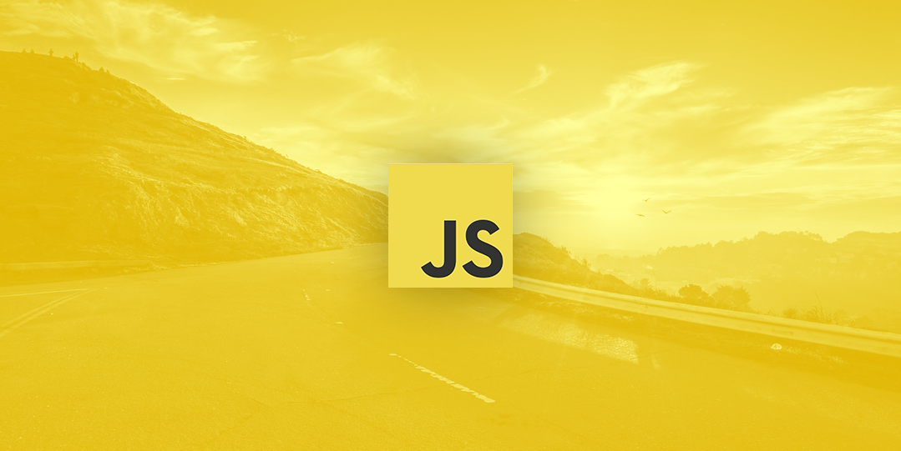

---
layout:		post
title:		'How to get started with JavaScript'
excerpt:	'Hey friends, after receiving a big response to my last article, I have decided to write another one to address questions that were put forward to me repeatedly.'
categories:	['translation']
tags:		['JavaScript', 'How To', 'Web Development']
---

### How to get started with JavaScript

Hey friends, after receiving a big response to [my last article](https://medium.com/@PatrykZabielski/how-to-make-multi-layered-parallax-illustration-with-css-javascript-2b56883c3f27), I have decided to write another one to address questions that were put forward to me repeatedly. “How did you learn Javascript? What are your resources? Can you recommend something?” so in this short article I will introduce you to some of the resources that will kickstart your Javascript adventure and few tips that I learned on the way that hopefully will help you have a head start and so you don’t repeat my mistakes..

A small disclaimer: I am not a Javascript expert. There’s still lots for me to learn. The article below outlines just one of the paths for learning Javascript.

### Few things before we dive in

1. **When you’re starting out: Learn from multiple sources, but don’t learn random things**. One of the most important things is to have a clear hierarchical structure when you’re starting out, so when you move from Chapter 1 to Chapter 2 you expand your previous knowledge instead of learning random chunks and trying to figure out by yourself how that adds up.

2. **Don’t spend all of your time on reading books or watching videos**. In short — do **stuff**!
Don’t read an entire book from cover to cover without trying things out. If you just learned how arrays work, explore that for a bit by creating few and experimenting with them (you can use **[CodePen](http://codepen.io/)** for that). It’s a lot to process, and trying out things will help you remember them.

3. **Find a mentor** — I had the opportunity to meet very good developers that helped me out and showed me what are the best practices. If you have hard time finding a mentor you can try out **codementor.io**.

4. **Join a community** — When it comes to joining a community, **[meetup.com](http://meetup.com/)** or FreeCodeCamp listed below is a good place to start.

5. Set up an account on **[CodePe](http://codepen.io/)**n or **[JSBin](https://jsbin.com/)** — these are great tools for testing things out. You have 3 panels HTML/CSS/Javascript and it gives you a live output, JSBin also has a console output.

6. And on **[Github](http://github.com/)** — it’s an open source platform where you can see how others solve problems and dig into their code. It’s also a great tool to share what you do and collaborate with others.

7. Aaaand on **[StackOverflow](http://stackoverflow.com/)** — it’s a forum for asking and answering programming questions. Search the database first when you want to ask about something. Usually someone has already asked about what you’re looking for or has had a similar problem.

### Resources

I don't want to overwhelm you with too many options so I will list out just the ones that will allow you to kickstart your learning, as well and provide a few different sources (offline, online, book, video — supplementary resources). I’ll also try to give you paid and free options.

1. Free/Interactive: [FreeCodeCamp](http://freecodecamp.com/) — a free, interactive way of learning by doing small exercises that has a very good hierarchy, you learn and see the results immediately, you also join a community which is a big bonus. Do it at the same time as you’re reading the books for best results.

2. Paid/Video/Interactive: [Treehouse](http://teamtreehouse.com/) — really good teachers that know how to explain things in an easy way. You watch a video and then answer a quiz or do a small exercise; they also provide you with tracks and they have recently added a “Javascript” track.

3. Free/E-Book: [Javascript for Cats](http://jsforcats.com/) — “So easy your human companion could do it too!”

4. Free/E-Book: [You don’t know JS — Up & Going](https://github.com/getify/You-Dont-Know-JS/tree/master/up%20%26%20going) — Short, well written and easy to understand ebook.

5. Paid/Book: [Javascript & jQuery](http://javascriptbook.com/) by Jon Duckett — a very visual way to learn Javascript that tries to remove the programming jargon and present content in clear, and easily digestible form — perfect for designers.

6. Paid/Book: [JavaScript: The Good Parts](http://www.amazon.co.uk/JavaScript-Good-Parts-Douglas-Crockford/dp/0596517742) by Douglas Crockford —this one might be a bit too hard if you’re just starting out but it’s a good book to read after going through other resources.

If you’re not afraid of options, and would like to explore more resources I recommend checking out this curated list by Eric Elliott — **[Essential JavaScript Links](https://github.com/ericelliott/essential-javascript-links)**.

### Still not sure where to start

As a personal recommendation — If I was starting out again, I would pick **FreeCodeCamp + Javascript & jQuery by JonDuckett** and supplement these two with Treehouse videos. But it’s always good to try out a few things and see what works best for you.

**Best of luck and have fun!**
